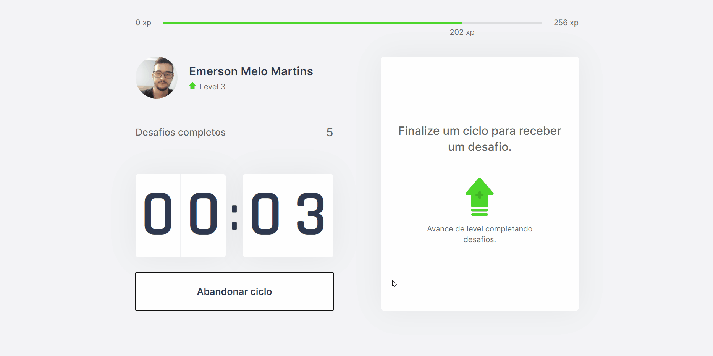

# Moveit

Aplicativo para se exercitar utilizando a técnica pomodoro.
<br />


## Instalação

Necessário ter [node](https://nodejs.org/en/) e/ou [yarn](https://classic.yarnpkg.com/lang/en/) para executar a aplicação localmente.

Você pode estar acessando online clicando [aqui](https://moveit-257gtuit0-emersonmelomartins.vercel.app/).

Depois de instalado node, dentro da pasta abra o terminal de comando (cmd, terminal, powershell) e execute o comando abaixo para estar baixando as dependências necessárias

Node
```bash
npm install
```

Yarn
```bash
yarn
```

Após baixar todas as dependências para inicializar o projeto execute o comando

Node
```bash
npm run dev
```

Yarn
```bash
yarn dev
```

Feito os comandos de execução, você pode estar acessando a aplicação pela url
```bash
http://localhost:3000/
```